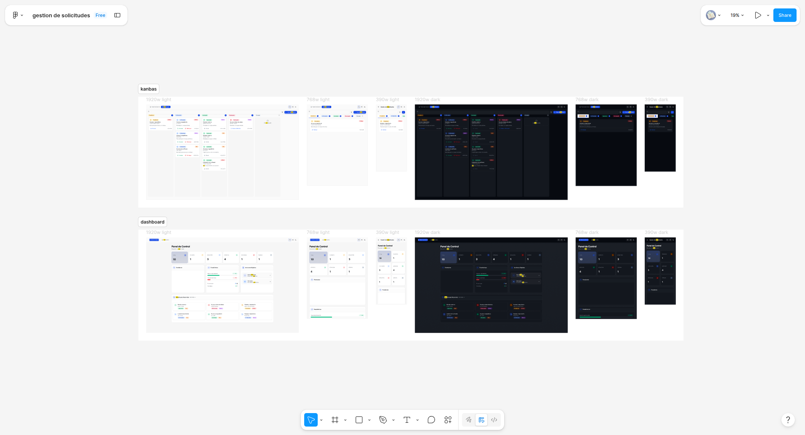
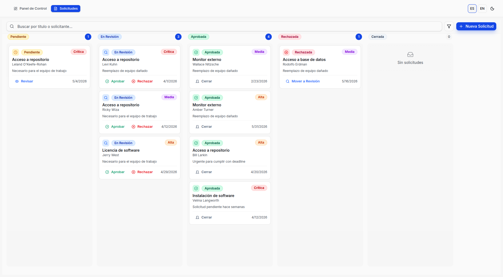
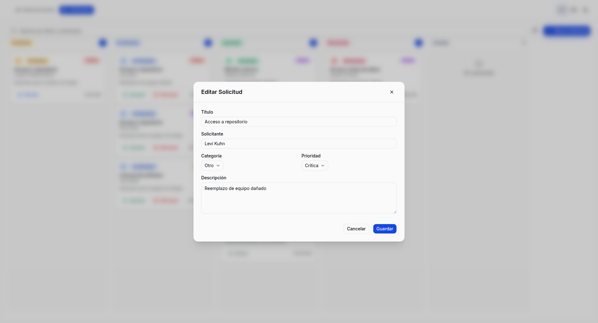
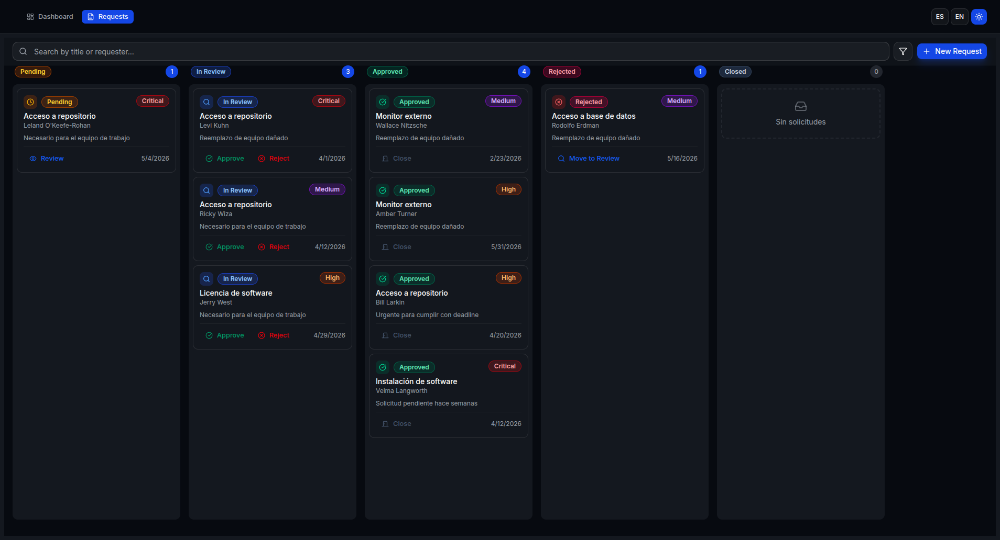
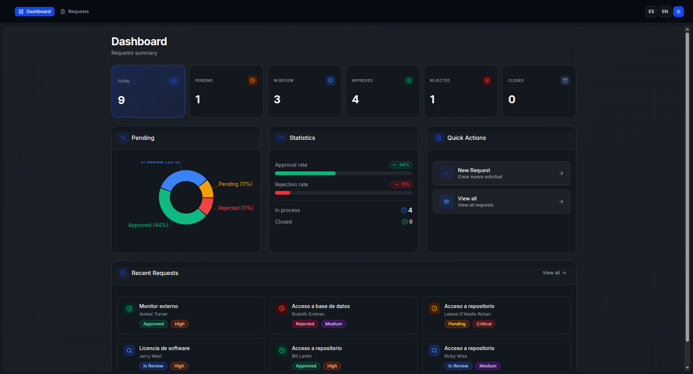

# Gestor de Solicitudes

Sistema web para gestionar solicitudes internas con tablero Kanban visual para revisar, aprobar y rechazar solicitudes.

## Demo

- **Aplicación**: https://prueba-sb.vercel.app/
- **Diseño Figma**: [](https://www.figma.com/design/EKc8yfBmBXWM7ugA0aS5HM/gestion-de-solicitudes?node-id=0-1&t=N3IIqtet26S1x4v7-1)

## Capturas







## Requisitos

- **Node.js** 20 o superior
- **Docker** (opcional, para despliegue)

## Instalación y Ejecución

```bash
# Instalar dependencias
npm install

# Ejecutar en desarrollo
npm run dev

# Construir para producción
npm run build

# Ejecutar en producción
npm start
```

La aplicación estará disponible en http://localhost:3000

## Comandos Disponibles

| Comando | Descripción |
|---------|-------------|
| `npm run dev` | Servidor de desarrollo con hot reload |
| `npm run build` | Construir aplicación para producción |
| `npm start` | Ejecutar versión de producción |
| `npm test` | Ejecutar pruebas unitarias (Jest) |
| `npm run cypress` | Abrir Cypress para pruebas E2E |
| `npm run cypress:run` | Ejecutar pruebas E2E en terminal |
| `npm run lint` | Verificar código con ESLint |
| `npm run typecheck` | Verificar tipos TypeScript |

## Arquitectura

```
src/
├── app/                    # Next.js App Router
│   ├── (dashboard)/        # Layout de dashboard
│   │   ├── page.tsx       # Dashboard principal
│   │   └── solicitudes/   # Módulo de solicitudes
│   └── api/               # API REST (mock)
├── components/            # Componentes React
│   ├── shared/            # Componentes compartidos
│   └── ui/                # Componentes de UI (shadcn/ui)
├── features/              # Features organizados por dominio
│   └── solicitudes/       # Lógica de solicitudes
├── hooks/                 # Custom hooks
├── lib/                   # Utilidades y configuración
├── services/              # Cliente API
└── types/                 # Tipos TypeScript
```

## API REST

Base URL: `/api/v1/solicitudes`

| Método | Endpoint | Descripción |
|--------|----------|-------------|
| GET | `/solicitudes` | Lista solicitudes (paginado) |
| GET | `/solicitudes/:id` | Detalle de solicitud |
| POST | `/solicitudes` | Crear solicitud |
| PUT | `/solicitudes/:id` | Actualizar solicitud completa |
| PATCH | `/solicitudes/:id` | Actualizar estado/prioridad |
| DELETE | `/solicitudes/:id` | Eliminar solicitud |

### Ejemplos con curl

```bash
# Crear solicitud
curl -X POST http://localhost:3000/api/v1/solicitudes \
  -H "Content-Type: application/json" \
  -d '{"title":"Nueva laptop","description":"Necesito laptop para desarrollo","requester":"Juan Pérez","category":"hardware","priority":"high"}'

# Cambiar estado
curl -X PATCH http://localhost:3000/api/v1/solicitudes/1 \
  -H "Content-Type: application/json" \
  -d '{"status":"approved"}'

# Eliminar solicitud
curl -X DELETE http://localhost:3000/api/v1/solicitudes/1

# Filtrar solicitudes
curl "http://localhost:3000/api/v1/solicitudes?status=pending&priority=high"
```

## Estados de Solicitud

```
Pendiente → En Revisión → Aprobada → Cerrada
                   ↓
               Rechazada → En Revisión
```

## Testing

### Pruebas Unitarias

```bash
npm test
```

Cubre:
- Componentes (StatusBadge, PriorityBadge, KanbanCard, etc.)
- Validación de esquemas (Zod)
- Servicios API

### Pruebas E2E (Cypress)

```bash
# Abrir interfaz gráfica
npm run cypress

# Ejecutar en terminal
npm run cypress:run
```

Flujos cubiertos:
- Dashboard y navegación
- Tablero Kanban
- Crear, editar, eliminar solicitudes
- Cambios de estado

## Stack Tecnológico

| Tecnología | Propósito |
|------------|-----------|
| Next.js 15 | Framework React con App Router |
| React 19 | Biblioteca UI |
| TypeScript | Tipado estático |
| Tailwind CSS | Estilos utility-first |
| shadcn/ui | Componentes UI base |
| TanStack Query | Gestión de estado servidor |
| React Hook Form | Formularios |
| Zod | Validación de datos |
| Cypress | Pruebas E2E |
| Sonner | Notificaciones toast |
| Framer Motion | Animaciones |
| Lucide Icons | Iconografía |
| next-intl | Internacionalización |

## Características

- ✅ Dashboard con resumen e indicadores
- ✅ Tablero Kanban por estado
- ✅ Búsqueda y filtros
- ✅ Crear/Editar/Eliminar solicitudes
- ✅ Cambios de estado visuales
- ✅ Dark mode
- ✅ Responsive (mobile/tablet/desktop)
- ✅ Optimistic updates
- ✅ Manejo de errores
- ✅ Loading states
- ✅ Validación de formularios
- ✅ i18n (español/inglés)
- ✅ Accesibilidad (ARIA, skip nav)
- ✅ Pruebas unitarias y E2E

## Docker

```bash
# Construir imagen
docker build -t gestor-solicitudes .

# Ejecutar contenedor
docker run -p 3000:3000 gestor-solicitudes

# O usar docker-compose
docker-compose up
```

## Mejoras Futuras

- Persistencia con base de datos (PostgreSQL/MongoDB)
- Autenticación y autorización
- Notificaciones en tiempo real (WebSockets)
- Exportación a PDF/Excel
- Historial de cambios
- Asignación de responsables
